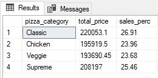

# Pizza-Sales-Dashboard

## Introduction 
This is an Excel and SQL project on Pizza sales data. This project is to analyse the data using both 
SQL and Excel and build a dasboard to visualize the result. 
## Problem Statements
1. When do we have the highest revenue
2. What is the average order value
3. What is the total number of pizza sold
4. What is the total number of order
5. What is the average pizza per order
6. The top 5 best and worst sellers
## Visualization
The dashboard contains total of 7 worksheets, namely:
1. Worksheets link
2. KPI
3. Dashboard
4. Total Trends For Orders
5. Best and worst sales
6. % sales for category and size
7. pizza_sales
# Calculated Metrics Using SQL
Total Pizza Sold|Total Order|Total Revenue |Total Pizza Sold by Category
:------: | :------: | :--------: | :--------:
|||

Average Order|Average Pizza Per Order
:-: | :-:|
|

Percentage Sales by Category | Percentage Sales by Size
:-: | :-:|
|

Daily Trend | Hourly Trend
:-: | :-:|
|

Top 5 Best Seller | Button 5 Worst Seller
:----: | :----:|
|

## Conclusion:
- The highest orders are recorded between Thursdays and Fridays, between the hour 12pm-13pm and 17pm-18pm
- Classic pizza contributed the highest sales and order
- The large pizza size generate the most revenue since it recorded the highest sales of all the pizza size and XX-Large has the least sales
- The Classic Deluxe Pizza is the most selling pizza and Brie Carre Pizza has the worst sale of them all
